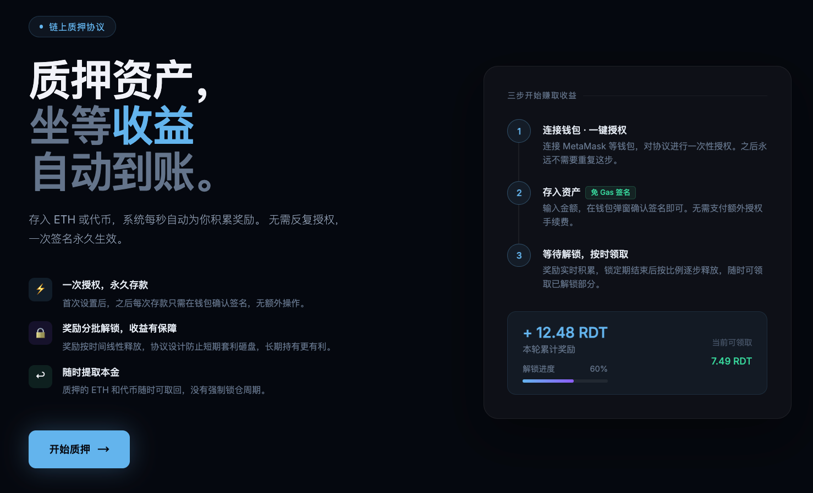
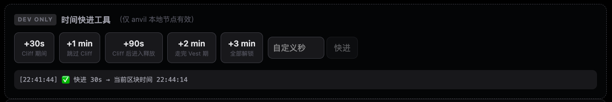
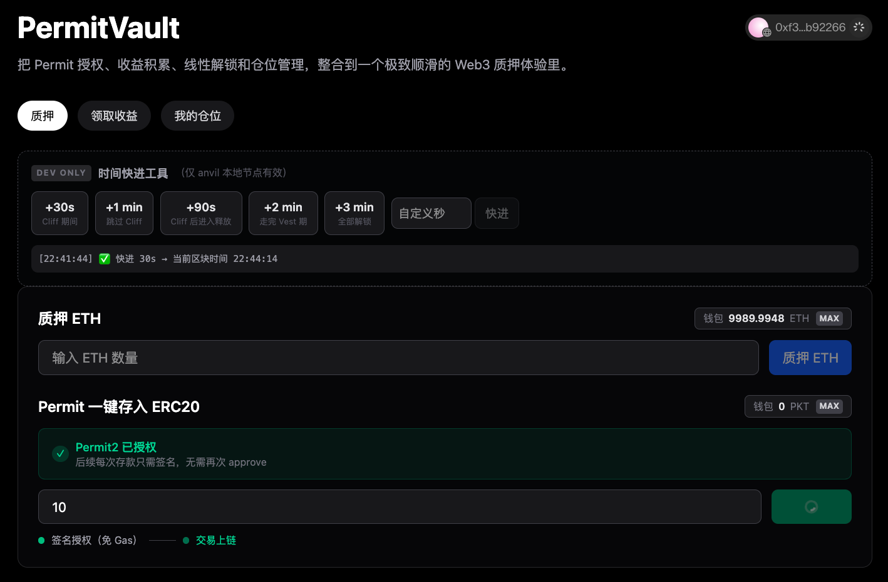
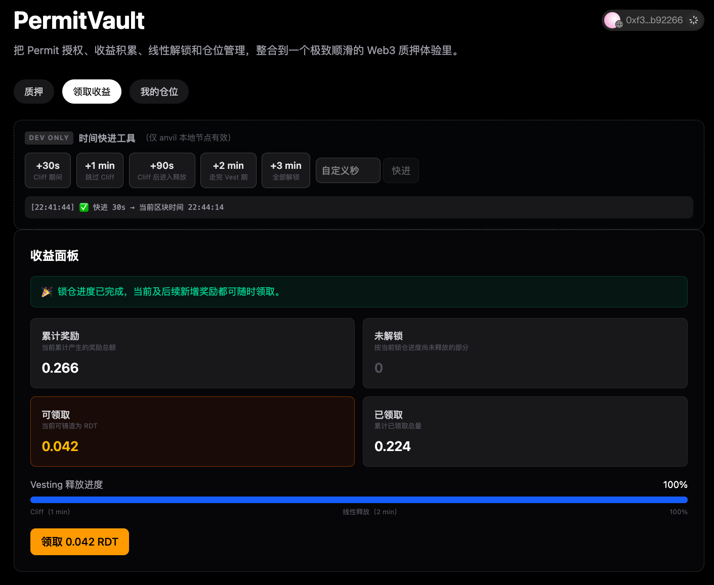
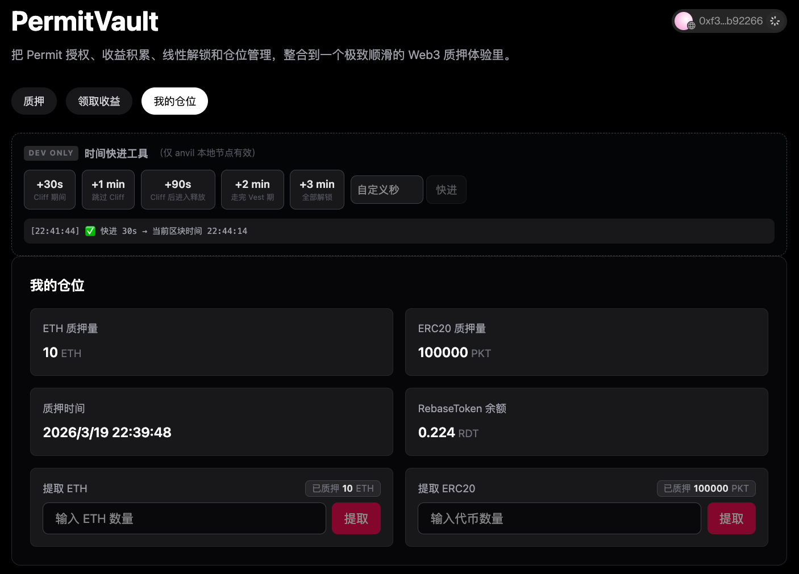
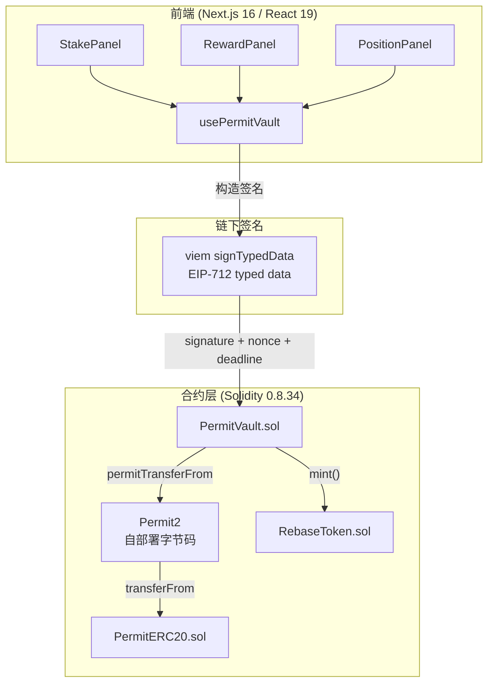
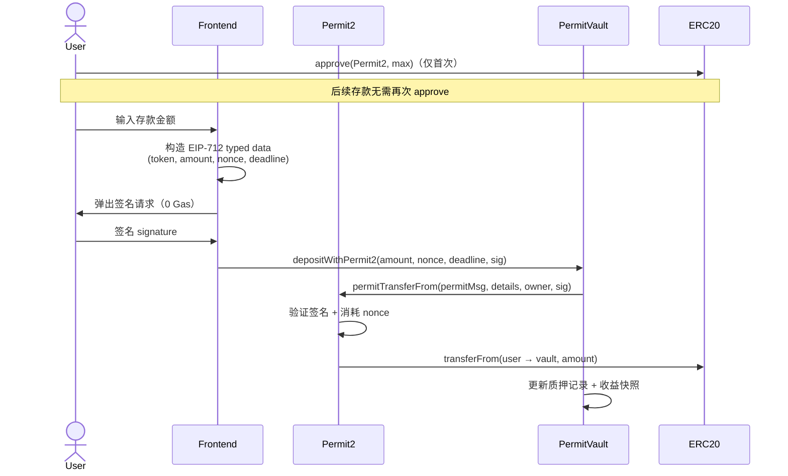
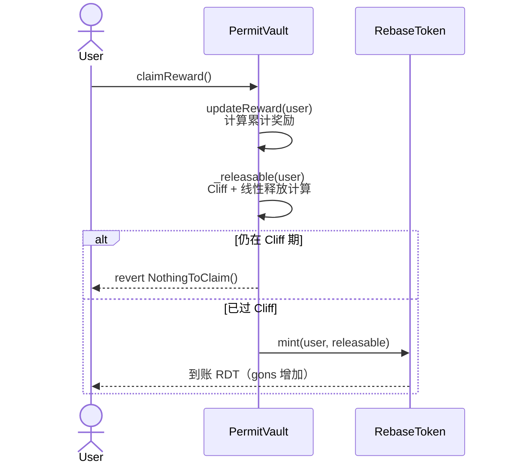
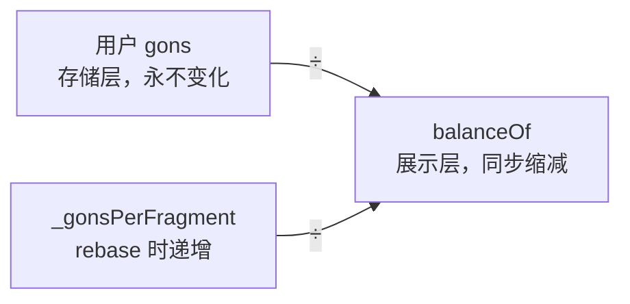

<h1 align="center">PermitVault</h1>

<p align="center">
  一个完整的链上质押协议<br/>
  <b>Permit2 · O(1) 收益 · Vesting · Rebase Token</b>
</p>

<p align="center">
  
</p>

<p align="center">
  
  
  
  
</p>

---

## 🚀 线上部署（Sepolia 测试网）

应用当前运行在 Sepolia 测试网络，所有合约均已完成部署并可在链上验证。

建议优先通过主域名访问，以获得更稳定的连接体验；如遇网络或区域访问问题，可使用 Vercel 备用入口。

| 合约               | 地址                                                                                                |
| ---------------- | ------------------------------------------------------------------------------------------------- |
| PermitVault      | [0xB3EC2...EC84](https://sepolia.etherscan.io/address/0xB3EC2Eb48198a22f62bf86d2c657D37a6985EC84) |
| PermitERC20（STK） | [0xCD6E...c43](https://sepolia.etherscan.io/address/0xCD6E773F12a98187E9ceb821558f7574E646ac43)   |
| RebaseToken（RDT） | [0x559A...CaF](https://sepolia.etherscan.io/address/0x559A800f03783ababc4D617eD7a0022544A70CaF)   |
| Permit2          | [0x0000...BA3](https://sepolia.etherscan.io/address/0x000000000022D473030F116dDEE9F6B43aC78BA3)   |

👉 **主入口（推荐）**
🔗 [https://permit-vault.ciphermagic.asia/](https://permit-vault.ciphermagic.asia/)

👉 **备用访问（Vercel）**
🔗 [https://permit-vault.vercel.app/](https://permit-vault.vercel.app/)

---

## ✨ 功能

* ⚡ **Gasless Deposit**：基于 Permit2，一次 approve 后永久免授权交易
* 📊 **O(1) 收益计算**：Synthetix Snapshot 算法
* ⏳ **Cliff + Linear Vesting**：奖励释放可控
* 🔁 **Rebase Token 模型**：余额自动缩放（gons / fragments）
* 🛡️ **安全机制**：Replay 防护 + ReentrancyGuard
* 🧠 **完整链路**：从签名 → 合约 → UI 全流程实现

---

## 📸 前端界面

### 开发者工具

> 本地网络可使用开发者工具修改区块时间

<p align="center">
  
</p>

### 质押面板

<p align="center">
  
</p>

### 收益面板

<p align="center">
  
</p>

### 仓位面板

<p align="center">
  
</p>

---

## 🤔 为什么做这个项目

市面上大多数质押 Demo 停留在"approve → deposit"两步流程，忽略了用户体验与协议安全性之间的工程权衡。PermitVault 尝试把几个真实 DeFi 协议中的核心机制拼接成一个可运行的完整系统：

- 用 **Permit2** 把授权+存款压缩成一笔交易
- 用 **Synthetix 快照算法**在 O(1) 复杂度下计算任意用户奖励
- 用 **Cliff + Vesting** 控制奖励释放节奏，而不是实时全额可提
- 用 **Rebase Token** 演示"份额不变、余额随时间缩放"的机制（Feature）

---

## 🏗️ 系统架构



---

## 🔄 核心流程

### Permit2 存款流程



### 奖励领取流程



---

## ⚙️ 核心技术实现

### 1. 🔐 Permit2 SignatureTransfer

用户只需对 Permit2 合约做一次 `approve(max)`，后续每次存款通过链下签名授权，无需额外 approve 交易。

```solidity
ISignatureTransfer.PermitTransferFrom memory permitMsg = ISignatureTransfer.PermitTransferFrom({
    permitted: ISignatureTransfer.TokenPermissions({
        token:  address(stakeToken),
        amount: amount
    }),
    nonce:    nonce,     // bitmap 防重放，前端随机生成
    deadline: deadline
});
permit2.permitTransferFrom(permitMsg, transferDetails, msg.sender, signature);
```

Permit2 内部完成签名验证 + nonce 消耗 + transferFrom，三步原子执行。前端通过 viem `signTypedData` 构造 EIP-712 结构体，domain 指向自部署的 Permit2 合约地址。

### 2. 📊 Synthetix 收益快照

每次存取操作触发全局快照更新，用户领取奖励时用份额乘以快照差值，计算复杂度 O(1)。

```solidity
modifier updateReward(address user) {
    rewardPerTokenStored = _rewardPerToken();
    lastUpdateTime       = block.timestamp;
    if (user != address(0)) {
        pendingRewards[user]         = _earned(user);
        userRewardPerTokenPaid[user] = rewardPerTokenStored;
    }
    _;
}

function _earned(address user) internal view returns (uint256) {
    uint256 stake = ethStakes[user] + tokenStakes[user][address(stakeToken)];
    return stake
        * (_rewardPerToken() - userRewardPerTokenPaid[user])
        / 1e18
        + pendingRewards[user];
}
```

### 3. ⏳ Cliff + Linear Vesting

奖励不实时可提，先经历锁定期（Cliff），再按时间线性释放。

```mermaid
gantt
    title 奖励解锁时间轴（本地测试参数）
    dateFormat X
    axisFormat %ss

    section 锁定期
    Cliff（不可领取）    : 0, 60

    section 线性释放
    0% → 50%            : 60, 120
    50% → 100%          : 120, 180
```



```solidity
function _releasable(address user) internal view returns (uint256) {
    uint256 start = vestingStart[user];
    if (start == 0) return 0;
    if (block.timestamp < start + CLIFF) return 0;

    uint256 totalEarned = pendingRewards[user];
    uint256 elapsed = block.timestamp - (start + CLIFF);

    uint256 vested;
    if (elapsed >= VEST_PERIOD) {
      // 单轮已全部解锁：账户下所有累计收益都可领取
      vested = totalEarned;
    } else {
      // 单轮未完全解锁：按这唯一一次进度线性释放
      vested = (totalEarned * elapsed) / VEST_PERIOD;
    }

    if (vested <= claimed[user]) return 0;
    return vested - claimed[user];
  }
```

`getStakeInfo` 返回累计奖励、已解锁、可领取、解锁进度（0–100），前端直接渲染进度条。

```solidity
function getStakeInfo(
    address user
  )
    external
    view
    returns (
      uint256 ethStaked,
      uint256 tokenStakedAmount,
      uint256 earned,
      uint256 releasable,
      uint256 vestedTotal,
      uint256 alreadyClaimed,
      uint8 lockProgress
    )
  {
    ethStaked = ethStakes[user];
    tokenStakedAmount = tokenStakes[user][address(stakeToken)];
    earned = _earned(user);
    alreadyClaimed = claimed[user];
    vestedTotal = earned;

    uint256 start = vestingStart[user];

    if (start != 0 && block.timestamp >= start + CLIFF) {
      uint256 elapsed = block.timestamp - (start + CLIFF);

      if (elapsed >= VEST_PERIOD) {
        releasable = earned > alreadyClaimed ? earned - alreadyClaimed : 0;
        lockProgress = 100;
      } else {
        uint256 vested = (earned * elapsed) / VEST_PERIOD;
        releasable = vested > alreadyClaimed ? vested - alreadyClaimed : 0;
        lockProgress = uint8((elapsed * 100) / VEST_PERIOD);
      }
    } else {
      releasable = 0;
      lockProgress = 0;
    }
  }
```

### 4. 🔁 Rebase Token

奖励代币采用 gons/fragments 模型：存储层记录份额（gons），展示层实时计算余额。

```
balanceOf(user) = _gonBalances[user] / _gonsPerFragment
```



每次 rebase 时 `_totalSupply × 0.99`，`_gonsPerFragment` 随之上调，所有用户余额同步缩减 1%，但 gons 不变。初始供应量为 0，由 PermitVault（owner）在用户 `claimReward` 时按需 mint，无预挖。

### 5. 🛡️ 合约安全

- `withdraw` 使用 OpenZeppelin `ReentrancyGuard` 防重入
- `depositWithPermit2` 依赖 Permit2 的 nonce bitmap，同一 nonce 不可重复使用
- Permit2 在本地 anvil 环境中通过预编译字节码自部署，行为与主网一致

---

## 🔧 技术选型说明

| 决策 | 选择 | 原因 |
|------|------|------|
| 授权方案 | Permit2 SignatureTransfer | 支持任意 ERC20，nonce bitmap 比 EIP-2612 更灵活 |
| 收益计算 | Synthetix 快照 | O(1) 复杂度，不随用户数量增长 |
| 奖励代币 | Rebase（gons 模型） | 演示"份额稳定、余额缩放"机制，区别于普通 ERC20 |
| 编译器 | Solidity 0.8.34 | 最新稳定版；Permit2 源码锁定 0.8.17，通过独立 profile 编译后提取字节码部署 |
| 前端 | Next.js 16 + wagmi 2 | App Router + Server Components；wagmi 提供开箱即用的合约读写 hooks |

---

## 🚀 快速开始

### 环境要求

- Node.js >= 18、pnpm >= 8
- Foundry（`foundryup` 安装）

### 本地部署

```bash
# 1. 安装 JS 依赖
pnpm install

# 2. 安装合约依赖
cd contracts && make install

# 3. 编译 Permit2（仅首次，生成 permit2.bytecode）
make permit2

# 4. 编译主合约 + 导出 ABI
make build

# 5. 启动本地节点（另一个终端）
anvil

# 6. 部署全套合约
make deploy-local

# 7. 把部署输出的地址写入根目录 .env.local
NEXT_PUBLIC_PERMIT2_ADDRESS=0x...
NEXT_PUBLIC_VAULT_ADDRESS=0x...
NEXT_PUBLIC_STAKE_TOKEN_ADDRESS=0x...
NEXT_PUBLIC_REWARD_TOKEN_ADDRESS=0x...
NEXT_PUBLIC_CHAIN_ID=31337
NEXT_PUBLIC_PROJECT_ID=<reown_project_id>

# 8. 启动前端
cd .. && pnpm dev
```

访问 `http://localhost:3000/permit-vault`

---

## 📁 项目结构

```
permit-vault/
├── contracts/
│   ├── src/
│   │   ├── PermitVault.sol       # 主合约（质押 + 奖励 + Vesting）
│   │   ├── PermitERC20.sol       # EIP-2612 测试代币
│   │   └── RebaseToken.sol       # Rebase 奖励代币
│   ├── script/
│   │   └── PermitVault.s.sol     # 部署脚本（含 Permit2 字节码部署）
│   ├── test/
│   │   └── PermitVault.t.sol     # Foundry 测试
│   └── Makefile
│
├── app/permit-vault/
│   ├── page.tsx                  # 主页面（Tab 导航 + 钱包连接）
│   ├── components/
│   │   ├── StakePanel.tsx        # ETH + Permit2 存款
│   │   ├── RewardPanel.tsx       # 收益查看 + 领取
│   │   └── PositionPanel.tsx     # 仓位 + 提款
│   ├── hooks/
│   │   └── usePermitVault.ts     # 合约交互封装
│   └── utils/
│       └── permit2.ts            # EIP-712 typed data 构造
│
├── scripts/
│   └── permit_vault_demo.ts      # 完整链下交互演示
│
└── abis/                         # forge inspect 导出
```

---

## 🧪 测试

```bash
cd contracts

forge test -vvv
forge test --match-test test_DepositWithPermit2
forge test --gas-report
```

覆盖场景：ETH 质押、Permit2 签名存款（含重放攻击）、奖励快照、Vesting 线性释放、无效签名拒绝、重入攻击防护、Fuzz 边界测试。

---

## 📄 许可证

MIT